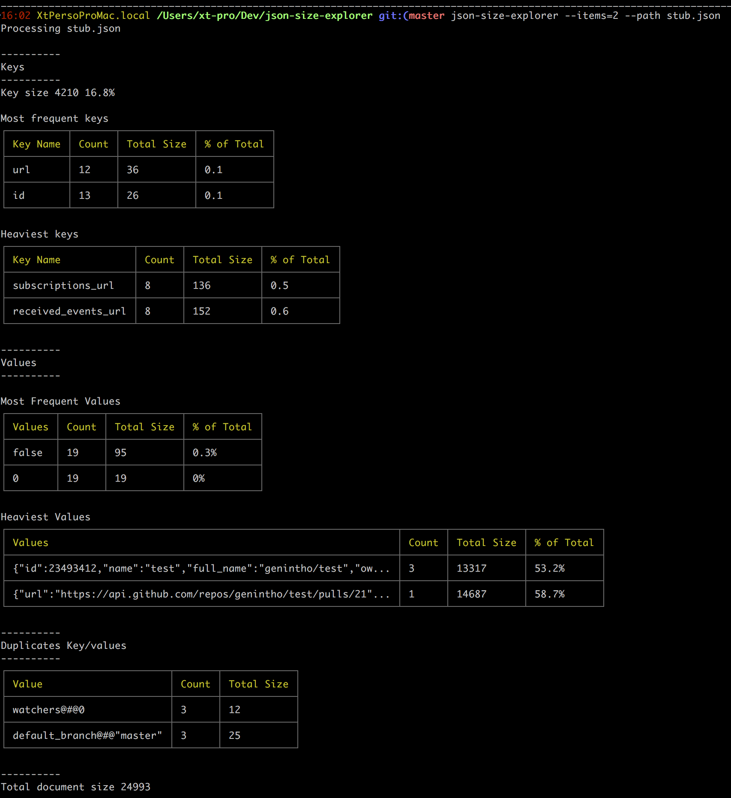

# json-size-explorer
Get insight about the content of your JSON documents.
Find what is taking the most space. Find duplicates, key size, depth, etc

## Install
`npm install -g json-size-explorer`

## Commands

```
json-size-explorer --help

  Usage: json-size-explorer [options]

  Options:
    --path [string]  Path of JSON document
    --items [num]    Add the specified type of cheese [marble] (default: 5)
    -h, --help       output usage information
```

## What can it do

- file size
- number of keys
- size of all keys
- count and size of each keys
- count and size of each values
- count of key-value combo to detect duplicated structures

## Screenshot



## Changelog


### 1.0.2

- Display the number of keys found in the document
- Align data in the column to improve readability